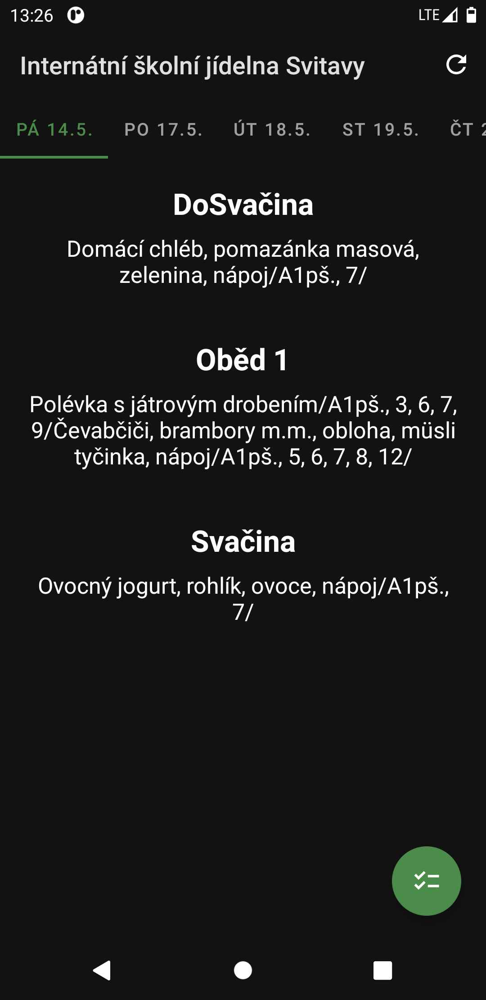

# iCanteen Jídelníček
**iCanteen Jídelníček** je open-source aplikace pro Android určená k jednoduchému a rychlému zobrazení jídelníčku u jídelen, které používají objednávkový systém iCanteen od společnosti Z-WARE s.r.o.

Aplikace nabízí:
- mezipaměť pro zobrazení jídelníčku i bez připojení k internetu
- podporu více jídelen
- možnost nastavit jídelnu jako oblíbenou (bude se automaticky zobrazovat po spuštění aplikace)
- zkratka (odkaz) na přihlašovací stránku objednávkového systému

Aplikace se instaluje z APK balíčku, který lze stáhnout [zde](https://github.com/vitlabuda/icanteen-jidelnicek/releases/latest).

## Upozornění
**Tato aplikce není nijak spojena se systémem iCanteen ani s jeho autorem, společností Z-WARE s.r.o. Jedná se pouze o neziskový komunitní open-source projekt.**

## Vestavěný seznam jídelen
Pokud chcete rozšířit vestavěný seznam jídelen, přidejte název jídelny a URL přihlašovací stránky do systému iCanteen do souboru [App.java](/app/src/main/java/cz/vitlabuda/icanteenjidelnicek/App.java) a založte pull request, případně issue.

## Screenshoty

    
    
    

## Licence
Tato aplikace je licencována pod 3-clause BSD licencí. Podrobnosti naleznete v souboru [LICENSE](LICENSE).

Aplikaci naprogramoval [Vít Labuda](https://vitlabuda.cz/).
